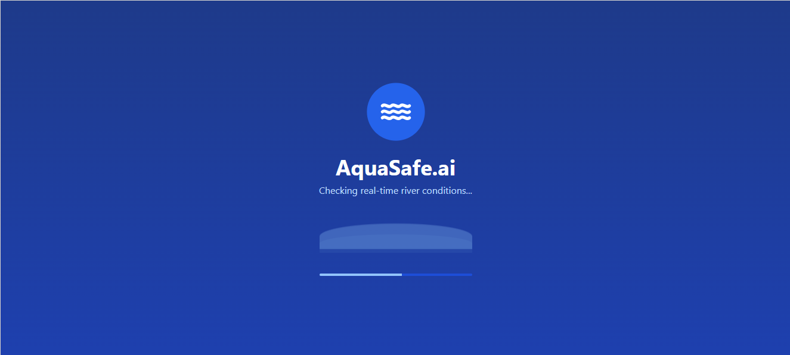
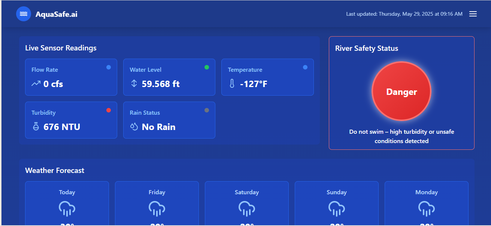
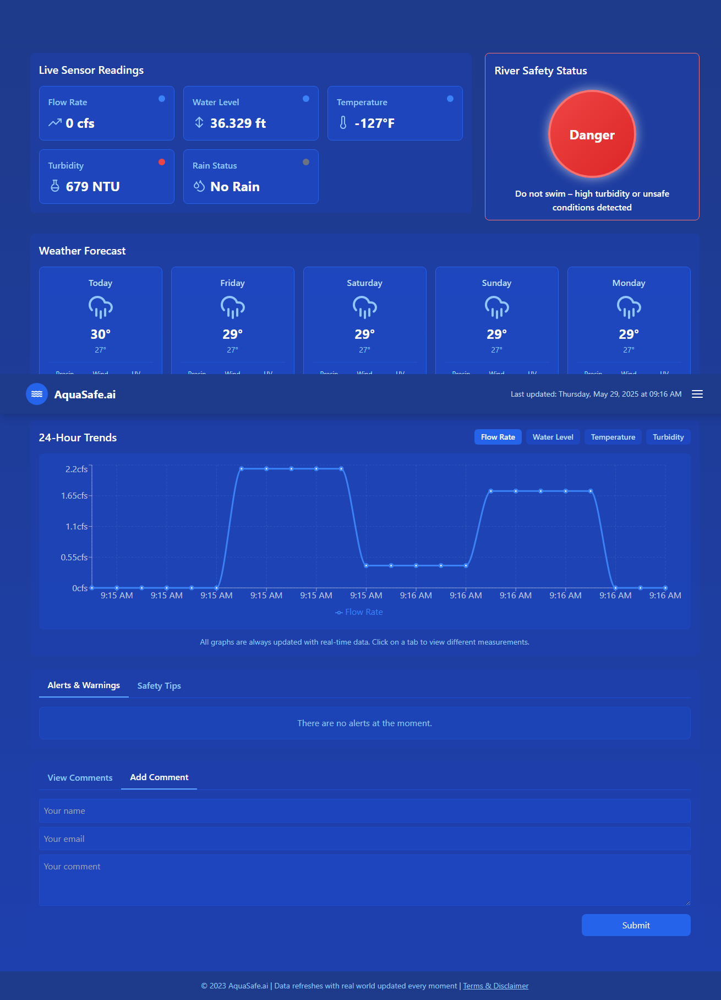
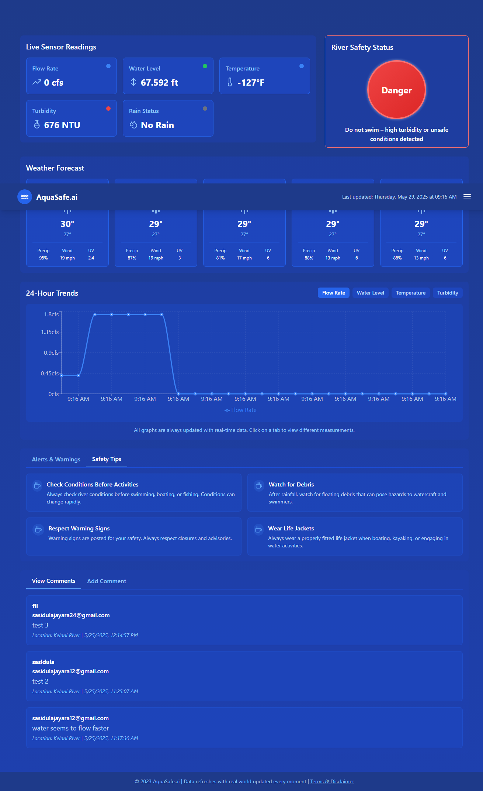

# River Safety Monitoring System 🌊🛡️

## 🌊 Project Overview

Rivers in Sri Lanka are frequently used for bathing and recreation. However, changes in water conditions—such as depth, flow, and turbidity—can create dangerous situations. AquaSafe addresses this by:

- Monitoring river conditions in real-time
- Using AI to predict safety levels ("Safe", "Caution", "Danger")
- Displaying information through a web app accessible via QR code
- Collecting user feedback and environmental reports

---

## 📌 Features

- 🌐 **Web App**: Real-time river safety data and historical trends
- 🤖 **AI-Powered Risk Analysis**: Safety predictions using machine learning
- 📡 **IoT Integration**: Sensors for depth, flow, temperature, turbidity, and rainfall
- 📊 **Data Visualization**: Charts and indicators to visualize sensor data
- 🔒 **Community Reporting**: Allow users to submit observations
- 📱 **QR Code Access**: Quick access to safety info at river locations

---

## 🔧 Technologies Used

| Category        | Technology                              |
|-----------------|-----------------------------------------|
| Microcontroller | NodeMCU ESP8266                         |
| Sensors         | Ultrasonic, Flow, Turbidity, Temp, Rain |
| Cloud Platform  | Firebase                                |
| Frontend        | React.js, Material UI, Chart.js         |
| Backend         | Spring Boot, Flask                      |
| AI/ML           | Python (Random Forest / XGBoost)        |
| Connectivity    | HTTP / MQTT (optional)                  |
| Access          | QR Code (web view)                      |

---

## 📂 Project Structure

```bash

aquasafe-webapp/
    src/
    ├── assets
    │   └── logo.jpg
    │   └── logo.png
    │   └── logo.svg
    ├── components/
    │   └── SelectLocation.jsx
    │   └── AlertsPanel.jsx
    │   └── SafetyIndicator.jsx
    │   └── WeatherForecast.jsx 
    │   └── SafetyTip.jsx
    │   └── RiverGraphs.jsx
    │   └── SensorGrid.jsx
    │   └── SensorCard.jsx      
    │   └── Footer.jsx
    │   └── Header.jsx
    ├── pages/
    │   └── TestSensorData.jsx
    ├── utils/
    │   └── firebase.js           # Firebase configuration
    │   └── useRealData.js        # Main hook integrating all data sources
    │   └── mockData.js           # Mock data for testing
    ├── App.jsx
    ├── index.js
```


## 🔧 Setup & Installation

### 1. Clone the Repository

```bash
git clone https://github.com/your-username/river-safety-monitor.git
cd river-safety-monitor
```


### 2. Install Dependencies

```bash
npm install
```

### 3. Setup Firebase

* Create a Firebase project.
* Add your configuration to `firebase.js` and set up your real-time database structure.

### 4. Setup WeatherAPI

* Register at [WeatherAPI](https://www.weatherapi.com/) and get an API key.
* Store it in an `.env` file:

```env
REACT_APP_WEATHER_API_KEY=your_api_key_here
```

### 5. Start Flask Backend (AI)

Ensure your Flask server is running locally on port `5000` and accepts POST requests at `/predict`.

### 6. Start the Development Server

```bash
npm start
```

---

## 🧪 AI Safety Prediction Endpoint

**Endpoint:** `POST /predict`

**Payload:**

```json
{
  "depth": 0.6,
  "current": 0.3,
  "temp": 29.5,
  "air_temp": 33.0,
  "turbidity": 80,
  "rainfall": 6.0,
  "wind_speed": 28.0,
  "gust_speed": 40.0,
  "humidity": 92,
  "cloud": 95,
  "feels_like": 38.0,
  "dew_point": 27.5,
  "uv_index": 1,
  "is_night": 1,
  "condition": 3
}
```

**Response:**

```json
{
  "safety_level": "Danger",
  "status_message": "Do not swim – high turbidity or unsafe conditions detected"
}
```
---

## 📆 Project Timeline

1. **Phase 1**: Research & Planning
2. **Phase 2**: Hardware Integration
3. **Phase 3**: Software Development
4. **Phase 4**: System Integration & Deployment
5. **Phase 5**: Testing & Final Documentation

---

## 📊 Historical Data

The app automatically builds up historical sensor readings in-memory for charting and trend visualization purposes.

---

## 📎 Future Improvements

- Mobile app integration
- Support for SMS alerts
- Offline sensor data caching
- Automatic recalibration of sensors

---

## 👥 Team Members

| Name                  | Student ID           |
|-----------------------|----------------------|
| J.D. Perera           | COHNDSE24.1F-042     |
| P.L.H. Indusara       | COHNDSE24.1F-052     |
| N.A.S. Jayara         | COHNDSE24.1F-053     |

---


## 🖼️ ScreenShots






---

## 📄 License

MIT License – Free to use and modify

---